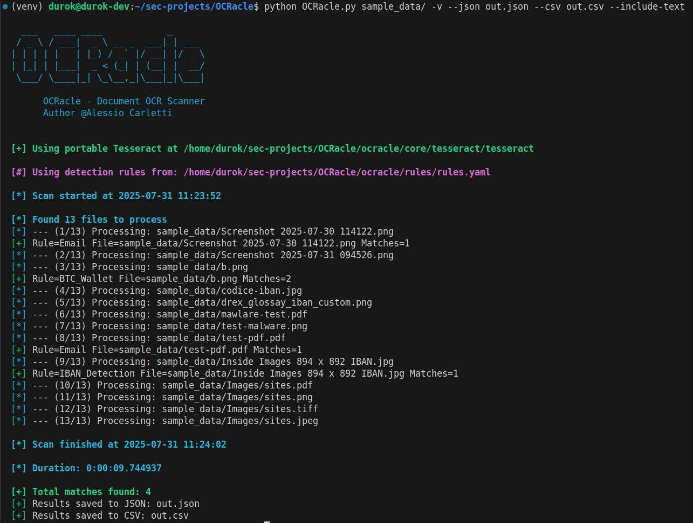

# **OCRacle**


<p align="center">
    
</p>

OCRacle is a modular Python tool (optionally portable) that recursively scans directories, extracts text from PDF and image files (native PDF text and OCR), and searches for keywords or regex patterns. Results can be printed on the console and optionally saved to JSON or CSV.
It is also useful as a service component for **Data Loss Prevention (DLP)** software.

<p align="center">
   <a href="https://ko-fi.com/durok" target="_blank">
      
   </a>
</p>

## **Main Features**

* Recursive scan of directories and subdirectories
* Supported file types:
  * **PDF** (native text extraction via PyMuPDF, fallback to OCR)
  * **Images** (JPG, PNG, TIFF, etc.)
* Multiple keyword/regex rules
* Output:
  * Console
  * JSON
  * CSV
* Optionally include the full extracted text in JSON/CSV output with `--include-text`
* Each result contains a progressive `match_id`
* At the end of the scan, a summary with the total number of matches is shown

---

## **Dependencies**

Python **3.9+** is recommended.

All required libraries are listed in the `requirements.txt` file.  
Additionally, all necessary `.whl` package files are already included in the `wheels` directory, making OCRacle portable and ready for offline installation as described in the procedure below.

OCRacle includes a portable, pre-configured **Tesseract OCR** binary and tessdata in the `core` directory, no extra setup needed.

---

## **Portable / Offline Setup (Air‑Gapped)**

To deploy OCRacle in an isolated environment without internet:

### **On an online machine**

1. Create and activate a virtual environment:

   ```bash
   python3 -m venv venv
   source venv/bin/activate
   ```

2. Install dependencies:

   ```bash
   pip install -r requirements.txt
   ```

3. Freeze dependencies:

   ```bash
   pip freeze > requirements.txt
   ```

4. Download all packages as `.whl` files:

   ```bash
   mkdir wheels
   pip download -r requirements.txt -d wheels
   ```

Copy the **entire OCRacle folder (including wheels/, requirements.txt, and code)** to the offline machine.

---

### **On the offline machine**

1. Create a virtual environment:

   ```bash
   python3 -m venv venv
   source venv/bin/activate
   ```

2. Install packages from the local wheels:

   ```bash
   pip install --no-index --find-links=wheels -r requirements.txt
   ```

3. Ensure that **Tesseract** (binary + tessdata folder) and, if required, **Poppler** are included in the project directory and configured in `core/text_extractor.py`.

4. Run:

   ```bash
   python OCRacle.py /path/to/folder
   ```

---

## **Usage**

Console only:

```bash
python OCRacle.py /path/to/folder
```

Save results:

```bash
python OCRacle.py /path/to/folder --json results.json --csv results.csv
```

Include extracted text in output:

```bash
python OCRacle.py /path/to/folder --json results.json --include-text
```

<p align="center">
   
</p>

---

## **Configuration**

Edit `config.py`:

* `ESTENSIONS` → file extensions to scan
* `RULES` → regex patterns to search

---

## **Output**

Example JSON:

```json
[
  {
    "match_id": 1,
    "rule": "iban",
    "file": "/docs/invoice1.pdf",
    "text": "..." 
  },
  {
    "match_id": 2,
    "rule": "secret_word",
    "file": "/images/photo.png",
    "text": "..."
  }
]

```

