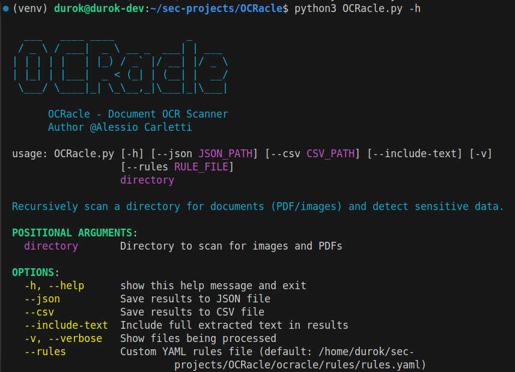

# **OCRacle**


<p align="center">
    
</p>

**OCRacle** is a modular Python tool (optionally portable) that recursively scans directories, extracts text from PDF and image files (native PDF text and OCR), and searches for keywords or regex patterns. 
Results can be printed on the console and optionally saved to JSON or CSV. It is also useful as a service component for **Data Loss Prevention (DLP)** software.

<p align="center">
   <a href="https://ko-fi.com/durok" target="_blank">
      
   </a>
</p>


## ✨ **Key Features**

* Recursive scan of directories
* File type detection using **magic bytes** (not extensions)
* Supported file formats:
  * **PDF** (native text extraction via PyMuPDF, fallback to OCR)
  * **Images** (PNG, JPG, TIFF, etc.)
* Detection rules defined in **YAML** (`ocracle/rules/rules.yaml`)
* Output options:
  * Console
  * JSON
  * CSV
* Options:
  * `--include-text`: include extracted text in results
  * `--rules <file>`: specify a custom YAML rule file
  * `-v` / `--verbose`: show files being processed
* Colorized logging
* Scan summary with total matches and start/end timestamps

## 📦 **Dependencies**

Python **3.8+** is recommended.

All required libraries are listed in the `requirements.txt` file.  
Additionally, all necessary `.whl` package files are already included in the `wheels` directory, making OCRacle portable and ready for offline installation as described in the procedure below.

OCRacle includes a portable, pre-configured **Tesseract OCR** binary and tessdata in the `ocracle/core` directory, no extra setup needed.


## 📦 **Portable / Offline Setup (Air‑Gapped)**

To deploy OCRacle in an isolated environment without internet:

### 🌐 **On an online machine**

1. Create and activate a virtual environment:

   ```bash
   python3 -m venv venv
   source venv/bin/activate
   ```

2. Download all packages as `.whl` files:

   ```bash
   mkdir wheels
   pip download -r requirements.txt -d wheels
   ```

Copy the **entire OCRacle folder (including wheels/, requirements.txt, and code)** to the offline machine.

To install dependencies in a typical (online) environment, simply run:

    ```bash
    pip install -r requirements.txt
    ```

---

### 🔒 **On the offline machine**

1. Create a virtual environment:

   ```bash
   python3 -m venv venv
   source venv/bin/activate
   ```

2. Install packages from the local wheels:

   ```bash
   pip install --no-index --find-links=wheels -r requirements.txt
   ```

3. Ensure that **Tesseract** (binary + tessdata folder) and, if required, **Poppler** are included in the project directory and configured in `core/text_extractor.py`.

4. Run:

   ```bash
   python OCRacle.py /path/to/folder
   ```


## 🚀 **Usage**

<p align="center">
    
</p>

Console only:

```bash
python OCRacle.py /path/to/folder
```

Save results:

```bash
python OCRacle.py /path/to/folder --json results.json --csv results.csv
```

Include extracted text in output:

```bash
python OCRacle.py /path/to/folder --json results.json --csv results.csv --include-text
```

Enable verbose mode to print files being processed:

```bash
python OCRacle.py /path/to/folder --verbose
```

Specify a custom YAML rules file:

```bash
python OCRacle.py /path/to/folder --rules custom_rules.yaml
```

Redirect console output to a file (e.g., `output.txt`):

```bash
python OCRacle.py /path/to/folder --verbose > output.txt
```

<p align="center">
   
</p>


## 📝 Rules (YAML)

Rules are stored in `ocracle/rules/rules.yaml`.
Example:
```yaml
rules:
  - name: IBAN_Detection
    description: "Detect Italian IBAN numbers (handles optional spaces)"
    pattern: "\\bI\\s*T\\s*\\d{2}(?:\\s*[A-Z0-9]){1,30}\\b"

  - name: SecretWords
    description: "Detect sensitive keywords"
    pattern: "\\b(secret|tlp|classified|password)\\b"
```

## 📊 **Output**

Example JSON:

```json
[
    {
        "index": 1,
        "rule": "Email",
        "file": "sample_data/Screenshot 2025-07-30 114122.png",
        "match_count": 1,
        "matched_text": [
            "aspammer@website.com"
        ],
        "text": " ... "
    },
    {
        "index": 2,
        "rule": "BTC_Wallet",
        "file": "sample_data/b.png",
        "match_count": 2,
        "matched_text": [
            "bc1qwes635e7dl0dxzic2q044arj5h0e6n4z06pl4a",
            "3J98t1WpEZ73CNmQviecrnyiWmqRhWNLy"
        ],
        "text": " ... "
    },
    {
        "index": 3,
        "rule": "Email",
        "file": "sample_data/test-pdf.pdf",
        "match_count": 1,
        "matched_text": [
            "aspammer@website.com"
        ],
        "text": " ... "
    },
    {
        "index": 4,
        "rule": "IBAN_Detection",
        "file": "sample_data/Inside Images 894 x 892 IBAN.jpg",
        "match_count": 1,
        "matched_text": [
            "IT 99 Z 12345 12345 123456789012\nyD"
        ],
        "text": " ... "
    }
]
```

